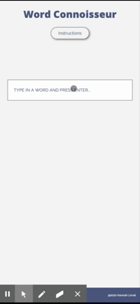

WORD CONNOISSEUR - Flashcard Site
---------------------------------

PROJECT DESCRIPTION
--------------------

Word Connoisseur is for people who want to look up words and customize their 
own word practice lists without going through the effort of making their
own flash cards through a site such as Quizlet. 

When the user gets to the site, they can look up a word and view its definition. They can then interact with the word by adding it to their word list, which will make the word appear as a flash card at the bottom of the screen. Flash cards and practice lists are saved to local storage, so your words will still be there when you open the website again. Users can go to the practice list to delete their words. 

APPROACH TAKEN
---------------
1) I started off by laying out the HTML and the basic CSS positioning for the mobile site. 
2) Next, I worked on the mvp features from the top down: event listener on input, adding word and 
definition to the DOM, event listener on add button, flashcard functionality, and practice list creation. 
3) Next, I did basic CSS positioning for the desktop site
4) Moved on to local storage, revisited js features with local storage in mind to refactor where needed
5) CSS design

INSTALLATION INSTRUCTIONS
-------------------------

Using this application requires an api key! I am using the Merriam Webster Collegiate Dictionary API, which can be accessed in the features/tech section below. 

1) Register for api key from Merriam API, they have an almost immediate response. 
2) clone this repo and, in your local repo, create a config.js file. Create a variable called "config" to hold your key: 

  const config = {
    key: 'your key goes here'
  }

3) You will now be able to use this application! I have my config.js in a .gitignore file, so if you do not make sure you change the src link in the index.html file. 

More info can be found in this very helpful github article by user derzorngottes - https://gist.github.com/derzorngottes/3b57edc1f996dddcab25

FEATURES / TECHNOLOGY USED
--------------------------

API : Merriam Webster Collegiate Dictionary API - https://dictionaryapi.com/products/index

Languages, Libraries, and Preprocessors : CSS, Sass/SCSS, JavaScript, jQuery

Main Features : 
* UI feature - instructions modal that is opened and closed by event listener on header button and modal button
* UI features - carousel in flashcard section that cycles through the flashcards on the practice list
* AJAX request to API pulls in vocabulary word and definition, triggered by pressing enter within input.
* Local Storage - If user clicks "add" button to add vocabulary word to their practice list, this also triggers a Local Storage function which stringifys the word and definition. Upon page reload, json is parsed back into flashcards and a practice list on the DOM. 

VISIT LIVE SITE
---------------
* Link to Site: hannahlivnat.github.io/ga-project1

UNSOLVED PROBLEMS
-----------------
* FlashCards - There is overflow within the textbox of the description side of the flashcard that I fixed by widening definition side, but makes flashcards look weird
* Some of the features are vulnerable to breakage which could be made better by refactoring into one-purpose functions
* A few of the nested for loops, particularly within local storage, seem really overnested, could be simplified with a different and more simple approach. 
* input stays zoomed in after return on mobile version

